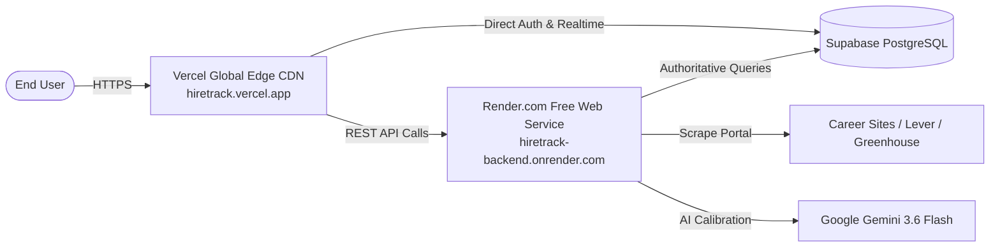

# HireTrack AI — Full-Stack Deployment Guide

This guide walks you through deploying **HireTrack AI** to production with **zero hosting costs**:
- **Frontend**: [Vercel](https://vercel.com) (Vite + React 19 SPA on Global Edge CDN)
- **Backend API**: [Render.com](https://render.com) (Node.js Express + WebSocket Server on Free Web Service Tier)
- **Database & Auth**: [Supabase](https://supabase.com) (PostgreSQL with Row Level Security)

---

## 🏛️ Deployment Architecture



---

## ⚙️ Step 1: Deploy Backend to Render (Recommended Free Backend Host)

Render provides a **100% free Web Service tier** that runs standard Node.js servers, supports persistent WebSockets, and handles the AI career site scraping engine without timeout restrictions.

### Option A: 1-Click Blueprint (Fastest)

A production blueprint [`render.yaml`](./render.yaml) is already configured at the root of the repository.

1. Go to the [Render Dashboard](https://dashboard.render.com).
2. Click **New +** ➔ **Blueprint**.
3. Select your `HireTrack` repository.
4. Render will automatically detect `render.yaml` and configure the service.
5. Fill in your environment variables when prompted and click **Apply**.

---

### Option B: Manual Web Service Setup

If you prefer to configure it manually in the Render dashboard:

1. Click **New +** ➔ **Web Service**.
2. Connect your `HireTrack` Git repository.
3. Configure the following settings:
   - **Name**: `hiretrack-backend`
   - **Region**: Choose the region closest to you
   - **Root Directory**: `backend`
   - **Runtime**: `Node`
   - **Build Command**: `npm install --include=dev && npm run build`
   - **Start Command**: `npm start`
   - **Instance Type**: `Free`
4. Under **Advanced Settings**, set **Health Check Path** to `/api/health`.
5. Under **Environment Variables**, add:

| Variable | Value | Description |
|:---|:---|:---|
| `NODE_ENV` | `production` | Production mode |
| `PORT` | `10000` | Render default port |
| `SUPABASE_URL` | `https://your-project.supabase.co` | Your Supabase project URL |
| `SUPABASE_SERVICE_ROLE_KEY` | `ey...` | Supabase Service Role Secret |
| `GEMINI_API_KEY` | `AIzaSy...` | Your Google Gemini API Key |
| `CORS_ORIGINS` | `*` | Allowed origins |

6. Click **Create Web Service**.
7. Once deployed, verify your backend:
   ```
   https://hiretrack-backend.onrender.com/api/health
   ```
   You should receive:
   ```json
   {
     "status": "healthy",
     "service": "HireTrack AI Backend API",
     "databaseMode": "supabase_live"
   }
   ```

---

## ⚡ Step 2: Deploy Frontend to Vercel

Vercel is pre-configured with [`frontend/vercel.json`](./frontend/vercel.json) to handle Single Page Application (SPA) routing, so refreshing on `/jobs`, `/optimizer`, or `/analytics` will never throw a 404 error.

### Deploying via Vercel Dashboard

1. Log in to [Vercel](https://vercel.com).
2. Click **Add New...** ➔ **Project**.
3. Import your `HireTrack` Git repository.
4. In the **Configure Project** screen:
   - **Framework Preset**: `Vite`
   - **Root Directory**: Click *Edit* and select **`frontend`**
   - **Build Command**: `npm run build` (Default)
   - **Output Directory**: `dist` (Default)
5. Expand **Environment Variables** and add:

| Variable | Value | Description |
|:---|:---|:---|
| `VITE_SUPABASE_URL` | `https://your-project.supabase.co` | Your Supabase project URL |
| `VITE_SUPABASE_ANON_KEY` | `ey...` | Your Supabase public Anon key |
| `VITE_API_BASE_URL` | `https://hiretrack-backend.onrender.com/api` | Your Render Backend URL + `/api` |

6. Click **Deploy**.
7. Vercel will build and assign you a live HTTPS domain (e.g. `https://hiretrack-ai.vercel.app`).
