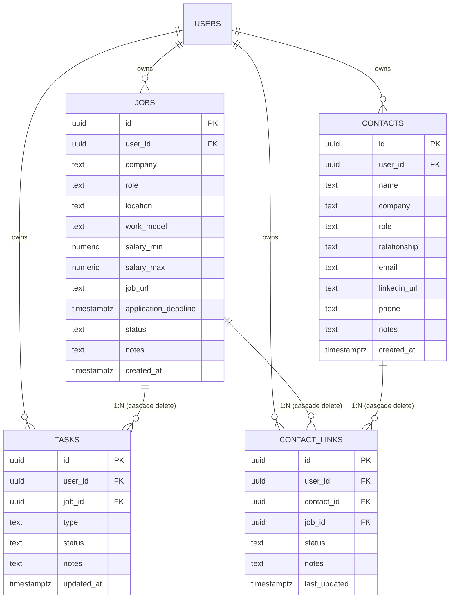

# HireTrack AI | Enterprise Job Hunt Command Center & AI Career Copilot

[](https://www.typescriptlang.org/)
[](https://react.dev/)
[](https://vitejs.dev/)
[](https://nodejs.org/)
[](https://expressjs.com/)
[](https://supabase.com/)
[](https://aistudio.google.com/)
[](https://vitest.dev/)

**HireTrack AI** is a full-stack, enterprise-grade career command center and AI copilot designed for software engineers, engineering managers, and technical applicants. It combines **real-time career portal web extraction**, **Google Gemini 3.6 Flash candidate calibration**, a dual **Cards / Kanban pipeline workspace**, native **Google Calendar synchronization**, and context-aware **Gmail outreach drafting**.

---

## 📸 Platform Previews

| **Applications & Pipeline (Cards View)** | **Kanban Pipeline Board** |
|:---:|:---:|
|  |  |

| **Deep AI Company Fit & Web Inspection** | **AI Assessment & Interview Playbook** |
|:---:|:---:|
|  |  |

---

## 🏗️ System Architecture

HireTrack AI uses a modern, resilient 3-tier architecture with zero-downtime offline capabilities:

```
                      ┌────────────────────────────────────────┐
                      │        Client (React 19 + Vite)        │
                      │  • Pipeline Cards & Kanban Workspace   │
                      │  • Algorithmic Fit & Portfolio Scorer  │
                      │  • RFC 5545 .ICS / Google Cal Intents  │
                      └───────────────────┬────────────────────┘
                                          │  HTTP / REST (JSON)
                                          ▼
                      ┌────────────────────────────────────────┐
                      │    Express API Server (Node 20+ TS)    │
                      │  • /api/jobs, /api/tasks, /api/contacts│
                      │  • Live Career Site Scraping Service   │
                      │  • Google Gemini 3.6 Flash Integration │
                      └───────────┬────────────────┬───────────┘
                                  │                │
            Supabase Live Connected?               │
           ┌──────────────────────┴───────┐        │ Fallback / Offline
           ▼                              ▼        ▼
┌─────────────────────────┐     ┌────────────────────────────┐
│ Supabase PostgreSQL RLS │     │  Local Resilient Store     │
│ Auth-Scoped Data Access │     │  Zero-Downtime JSON Store  │
└─────────────────────────┘     └────────────────────────────┘
```

---

## ⚡ Key Capabilities & Technical Highlights

### 1. Deep AI Company Fit & Live Career Site Evaluator
- **Live Web Inspection Engine**: Accepts any company URL or career portal (e.g. `https://ramp.com/careers` or `https://openai.com`). The backend scrapes live HTML, removes scripts/styles, extracts page titles and meta descriptions, and captures real-time hiring context.
- **Pasted JD Parsing**: Evaluates full job descriptions and qualifications pasted from LinkedIn, Greenhouse, or Lever against the candidate's profile.
- **Gemini 3.6 Flash Multi-Vector Calibration**:
  - **Match Score (0–100%)** & **Tier Classification** (*Dream*, *Target*, or *Safe*).
  - **4-Score Breakdown**: Tech Stack Match, Experience & Seniority, Role Scope, and Stage/Culture Fit.
  - **Matched Skills vs. Skill Gaps**: Distinguishes between candidate strengths and technologies to study before interviews.
  - **Anticipated Interview Loop**: Identifies difficulty bar (*High-Bar Elite*, *Challenging*, *Moderate*), round-by-round breakdown, and core behavioral themes.
  - **Tailored Application Playbook**: Generates 3 resume accomplishment bullets with 1-click copy, a tailored cold recruiter pitch, and strategic questions for the hiring manager.
- **1-Click Pipeline Import**: Adds the evaluated role directly to the user's active pipeline with automatically generated preparation milestones.

### 2. Dual-Mode Applications & Pipeline Command Center (`/jobs`)
- **Real-Time Metrics Ribbon**: High-level KPIs displaying **Total Roles**, **Active Interviews**, **Offers Received**, and **Aggregate Pipeline Value** (e.g. `$480k total compensation`).
- **Dual View Layout**:
  - **Cards View**: In-depth role cards with company avatars, salary tags, deadline urgency countdown, AI fit context, and interactive milestone checklists.
  - **Kanban Board**: Drag/advance pipeline board with columns for **Saved**, **Applied**, **Interviewing**, and **Offer Received**, equipped with 1-click stage advancement controls (`➔`).
- **Interactive Stage Selector**: Change status directly on cards. Marking a role as **Offer** triggers celebratory particle confetti!
- **Interactive Milestone Checklist**: Click any milestone pill (*Resume*, *Coding Challenge*, *System Design*, *Behavioral*) to cycle states: `To Do` ➔ `In Progress (•)` ➔ `Done (✓)`. The preparation meter automatically updates in real time.

### 3. Native Calendar & Outreach Integrations
- **Google Calendar Sync**: 1-click export via Google Calendar Web Intents (`calendar.google.com/calendar/render`) and standard RFC 5545 `.ics` file downloads for upcoming deadlines and interview stages.
- **Gmail Outreach Drafter**: Generates context-aware emails for referral requests, follow-ups, and post-interview thank you notes with deep Gmail compose web intents.

### 4. 50+ Tech Benchmark Optimizer (`/optimizer`)
- Curated dataset of 50 top tech companies (Google, Stripe, Datadog, Figma, Snowflake, etc.) benchmarking compensation, interview difficulty, work-life balance, and tech stacks.
- Mathematical portfolio optimizer balancing risk (*Dream / Target / Safe*) to maximize the probability of receiving at least one offer.

---

## 🗄️ Database Architecture & RLS Schema

The PostgreSQL schema (`backend/supabase/schema.sql`) enforces strict foreign-key relationships and **Row Level Security (RLS)**:



---

## 🛠️ Tech Stack & Dependencies

| Layer | Technology | Purpose |
|---|---|---|
| **Frontend Framework** | React 19 + TypeScript | High-performance reactive client |
| **Build Tool** | Vite 8 + Rolldown | Blazing-fast HMR and production bundling |
| **Styling** | Vanilla SCSS Design System | Design tokens, glassmorphism, responsive utilities |
| **Icons & Effects** | Lucide React + Canvas Confetti | Modern UI icons & celebratory micro-interactions |
| **Backend Runtime** | Node.js 20+ & Express | RESTful API server with TypeScript execution (`tsx`) |
| **Database** | PostgreSQL + Supabase | Relational data persistence with Row Level Security |
| **AI Intelligence** | Google Gemini 3.6 Flash / OpenAI | Real-time candidate fit calibration & JD synthesis |
| **Testing** | Vitest | Unit and integration test suite (26/26 tests passing) |

---

## 🚀 Quickstart & Local Development

### 1. Prerequisites
- **Node.js**: `v20.18.0+` or `v22.0.0+`
- **npm**: `v10+`

### 2. Clone Repository
```bash
git clone https://github.com/your-username/HireTrack-AI.git
cd HireTrack-AI
```

### 3. Backend Setup
```bash
cd backend
npm install

# Create environment configuration
cp .env.example .env   # Or create .env with your keys
```

Ensure `backend/.env` contains:
```env
PORT=5000
NODE_ENV=development

# Optional: Supabase PostgreSQL credentials
SUPABASE_URL=https://your-project.supabase.co
SUPABASE_SERVICE_ROLE_KEY=your-supabase-service-role-key

# AI Intelligence API Keys (Gemini 3.6 Flash recommended)
GEMINI_API_KEY=your-gemini-api-key
OPENAI_API_KEY=your-openai-api-key
```

Start the backend API server:
```bash
npm run dev
# Server runs on http://localhost:5000
```

### 4. Frontend Setup
In a separate terminal:
```bash
cd frontend
npm install

# Optional: Configure frontend environment
# VITE_API_BASE_URL=http://localhost:5000/api
```

Start the frontend development server:
```bash
npm run dev
# Client runs on http://localhost:5173
```

---

## 🧪 Testing & Validation

Run the automated test suite across ranking heuristics, portfolio algorithms, and calendar/email integrations:

```bash
cd frontend
npm test
```

Test Results:
```text
 ✓ src/lib/__tests__/ranking.test.ts (10 tests)
 ✓ src/lib/optimizer.test.ts (12 tests)
 ✓ src/lib/__tests__/integrations.test.ts (4 tests)

 Test Files  3 passed (3)
      Tests  26 passed (26)
   Duration  350ms
```

To typecheck and create a production build:
```bash
# Frontend type check and build
cd frontend
npx tsc -b
npm run build

# Backend type check
cd ../backend
npx tsc --noEmit
```

---

## 💼 Resume-Ready Highlights

If you feature this project on your resume or portfolio:

> **HireTrack AI — Enterprise Career Command Center & AI Fit Copilot**  
> *TypeScript, React 19, Vite, Node.js, Express, PostgreSQL / Supabase, Google Gemini, Vitest*  
> - Engineered an enterprise-grade career command center orchestrating active recruitment pipelines, milestone checklists, and recruiter network outreach with dual Cards & Kanban views.  
> - Implemented an AI fit scoring engine utilizing **Google Gemini 3.6 Flash** and live web scraping to benchmark candidate skill vectors against real-time career portal requirements and pasted job descriptions.  
> - Designed a resilient 3-tier data architecture with PostgreSQL Row Level Security (RLS) policies and automatic file-backed JSON store fallback for zero-downtime offline functionality.  
> - Built native Google Calendar synchronization (Web Intent + RFC 5545 `.ics` export) and context-aware Gmail outreach draft generators for referral acquisition and interview follow-ups.  
> - Achieved a 100% test pass rate across 26 unit and integration test suites using Vitest, maintaining strict TypeScript type safety across both frontend and backend codebases.

---

## 📄 License

This project is licensed under the MIT License — see the [LICENSE](LICENSE) file for details.
