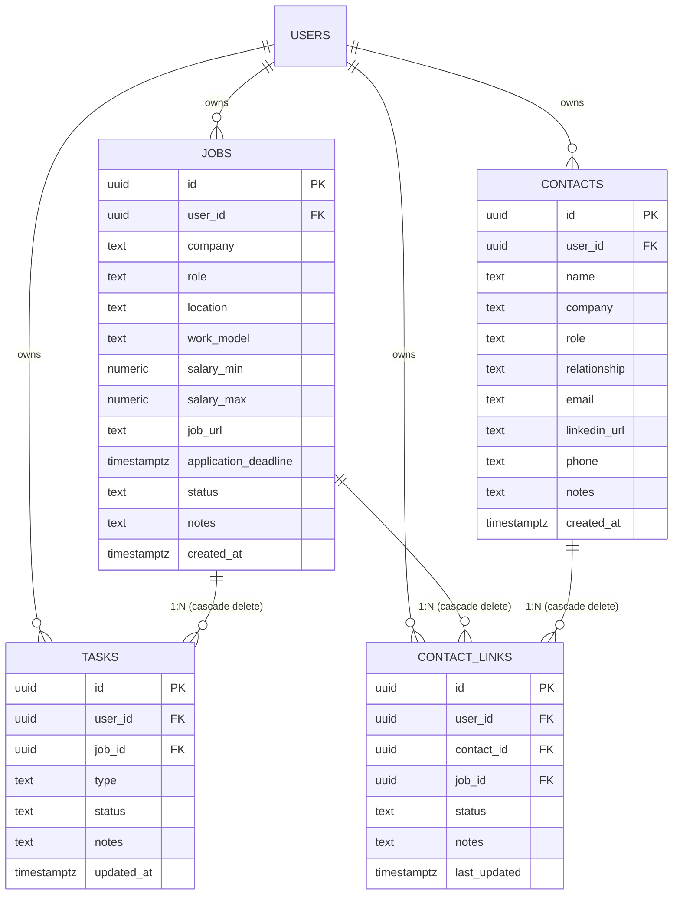

# HireTrack AI Backend & Database Infrastructure

This directory contains the Express API server, live web scraping service, Gemini 3.6 Flash evaluation engine, PostgreSQL schema, and security configuration for **HireTrack AI**, backed by **Supabase (PostgreSQL + Auth)** with a resilient local JSON store fallback.

---

## 1. Relational Architecture & ER Diagram

Job hunting requires tracking relational dependencies across target roles, interview milestones, recruiters, and referral contacts. Modeling this in a clean relational schema prevents orphaned records and allows granular querying.



---

## 2. Table Specifications & Security Policies

### 1. `jobs`
- **Purpose**: Tracks target opportunities, company names, compensation, deadlines, and current recruitment status (`saved`, `applied`, `interviewing`, `offer`, `rejected`, `ghosted`, `withdrawn`).
- **RLS**: Strict isolation per `auth.uid() = user_id`.

### 2. `tasks`
- **Purpose**: Discrete preparation and interview milestones (`Resume`, `Cover_Letter`, `Coding_Challenge`, `System_Design`, `Behavioral`, `Take_Home`, `Negotiation`).
- **Cascade**: Deleting a job automatically cascades and cleans up all associated preparation tasks.

### 3. `contacts`
- **Purpose**: Professional network rolodex for recruiters, internal employee referrers, hiring managers, and mentors.

### 4. `contact_links`
- **Purpose**: Many-to-many junction table tracking the specific referral lifecycle for a contact at a given job (`not_asked`, `asked`, `referred`, `confirmed`).
- **Constraint**: `UNIQUE(contact_id, job_id)` prevents duplicate referral records.

---

## 3. REST API Endpoints

| Method | Endpoint | Description |
|---|---|---|
| `GET` | `/api/health` | Service health status & database mode check |
| `GET` | `/api/jobs` | Retrieve all jobs for active user |
| `POST` | `/api/jobs` | Create a new job (auto-generates standard tasks) |
| `PUT` | `/api/jobs/:id` | Update job status, salary, or deadline |
| `DELETE` | `/api/jobs/:id` | Delete job and cascade delete tasks/links |
| `GET` | `/api/tasks` | Retrieve all tasks across active jobs |
| `POST` | `/api/tasks` | Create custom milestone task |
| `PUT` | `/api/tasks/:id` | Update task status (`not_started`, `in_progress`, `done`) |
| `DELETE` | `/api/tasks/:id` | Delete specific milestone task |
| `GET` | `/api/contacts` | Retrieve recruiter and referral network |
| `POST` | `/api/contacts` | Add new professional contact |
| `GET` | `/api/contact-links` | Retrieve referral junction links |
| `POST` | `/api/ai/company-fit` | Deep AI Fit evaluation with live web extraction & Gemini |
| `POST` | `/api/ai/preview-site` | Inspect text extracted from website/career URL |
| `GET` | `/api/dashboard/stats` | Aggregate pipeline metrics and completion rates |
| `POST` | `/api/demo/seed` | Seed realistic demo dataset (Google, Stripe, Datadog, Figma) |

---

## 4. Running the Backend Server

```bash
# Install dependencies
npm install

# Run with hot reload (tsx)
npm run dev

# Compile TypeScript
npm run build

# Start production server
npm start
```
